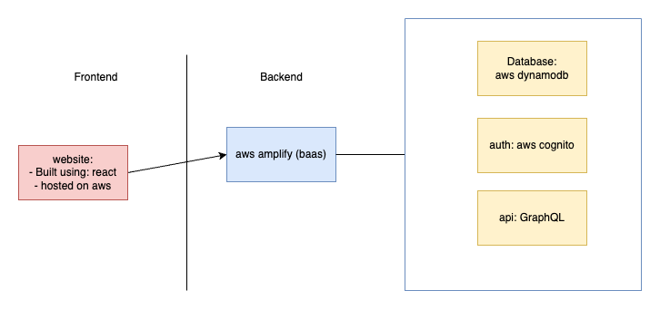
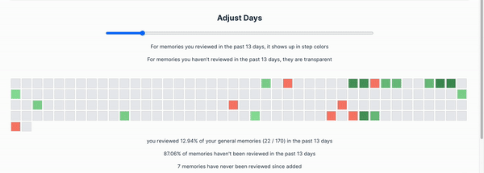
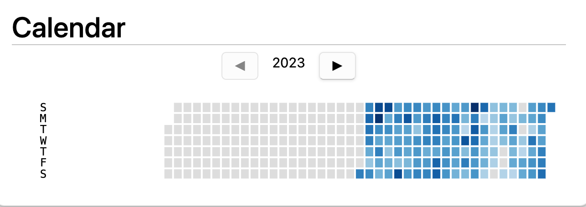
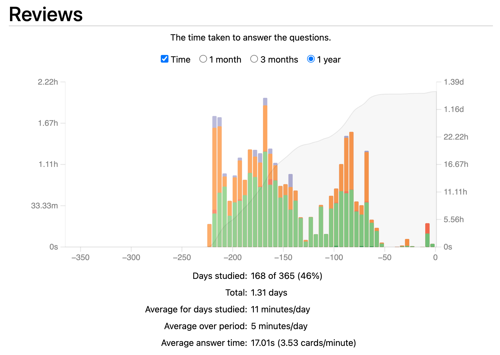

# Memory Mate

Authors: [Xiaxi Shen](https://github.com/xshen053)

## Table of Contents

1. [Project Description](#project-description)  
   1.1 [Goal](#goal)  
   1.2 [tech stack](#tech-stack)
2. [Software Architecture](#software-architecture)
3. [Project Demo](#project-demo)
4. [Testing](#testing)  
   4.1 [Run Test](#run-test)
5. [How Users Benefit](#how-users-benefit)

## Project Description

### Goal
- The goal of this project is to build a task management tool to help student or anyone who has a need to manage their task and learning plans to succeed.

### Tech stack
- The languages/tools/technologies I used.

  - [React](https://react.dev/) -  Using react for frontend

  - [Aws Amplify](https://aws.amazon.com/amplify) - Using amplify to provide backend service

  - [Javascript](https://www.javascript.com/) - I used javascript programming language

  - [Visual Studio Code](https://code.visualstudio.com/) - I used VS Code as Integrated development environment.

  - [Jest](https://jestjs.io/) - I used jest for testing

## Software Architecture

## Project Demo

### Feature: memory palace
> This is a screen where user can see visualized heatmap of their general memories, this can help user understand reviewing progress of each of their memories and help them prioritize which memory they should review first

# Testing

## run test

`npm test`

# How Users Benefit

I have been using this application since last august, and I combine it with Anki.

The result is to be honest, incrediable. It is a reminder for me every day to tell me what I should memorize and review every day. And During the second half of last year. Since August, I have been refreshing memories every day. This is a memory palace for me.

The next step, I am gonna bring this app up, so that other studnets can benefit and build their own memory palace!

