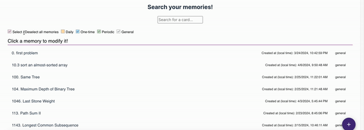

# Memory Mate (Merym)

Author: [Xiaxi Shen](https://github.com/xshen053)

[Connect on Linkedin](https://www.linkedin.com/in/xiaxishen)

## Table of Contents

- [Project Description](#project-description) 
  - [Motivation](#motivation) 
  - [Goal](#goal)
  - [Tech stack](#tech-stack)
- [Software Architecture](#software-architecture)
- [Demo](#project-demo)
  - [Features](#features)
    - [1 - Today's Memories](#1---todays-memories)
    - [2 - Today's Highlight](#2---todays-highlight)
    - [3 - Calendar](#3---calendar)
    - [4 - Reinforced Memories](#4---reinforced-memories)
    - [5 - Memory Palace](#5---memory-palace)
    - [6 - Explorer](#6---explorer)
    - [7 - Sign in / Sign Out](#7---sign-in-sign-out)
- [Testing](#testing)
  - [Run Test](#run-test)
- [How Users Benefit](#how-users-benefit)
- [Get Started!](#get-started)

## Project Description

### Motivation
This is a full-stack project using React and AWS Amplify. The motivation is that I found I can't consistently remember leetcode problem I solved. The problem is there was not an ideal tool for me to keep track of the problems I solved and also when I need to review it again. So last summer, I decided to develop an application for myself. It started off as a django application, at some point I decided to make it a real application and after I got exposed to a serverless compute backend framework (AWS Amplify) in a collaborative project. I ended up using aws amplify as backend and refactor the application. Through lots of iteration, this product currently has lots of features I am satisfied and I have been using it every day. I also introduced it to some of my friends, but since it is still under development, so I haven't officially released it. 

I built this application from scratch on my own. I applied things I learned through my previous internship and collaboration. I designed UI/UX using Figma, I wrote design docs, unit tests. I designed data model and set up CI/CD and deployed it. Recently I am developing a new feature, I am proud of myself. Any feedbacks are welcomed!

### Goal
- The goal of this project is to build a task (memory) management platform to help student or anyone who has a need to manage their memories and learning plans to succeed.

### Tech stack
- The languages/tools/technologies I used.

  - [React](https://react.dev/) -  Using react for frontend

  - [AWS Amplify](https://aws.amazon.com/amplify) - Using amplify to provide backend service

  - [AWS Dynamodb](https://aws.amazon.com/dynamodb/) - I used aws dynamodb for data model

  - [Javascript](https://www.javascript.com/) - I used javascript programming language

  - [Visual Studio Code](https://code.visualstudio.com/) - I used VS Code as Integrated development environment.

  - [Jest](https://jestjs.io/) - I used jest for testing
  
  - [Github Action](https://docs.github.com/en/actions) - I used github action for CI/CD

## Software Architecture

## Project Demo

### Features

#### 0 - Add memories
> A button on the right bottom corner that user uses to add memory

#### 1 - Today's Memories
> This is the screen showing user all memories it suggests you to refresh today

#### 2 - Today's Highlight
> This is the screen showing all memories you refreshed today

#### 3 - Calendar
> This is the screen showing a calendar so that you can see what memories you need to check or you already refreshed every day

#### 4 - Reinforced memories
> This is the screen where user can see information of user's all general memories (reinforced memory) including information like
- last review date
- creation date
- review times
- title

#### 5 - memory palace

*The latest feature!*

https://mymemorycompanion.com/MemoryPalace

> This is a screen where user can see visualized heatmap of their general memories, this can help user understand reviewing progress of each of their memories and help them prioritize which memory they should review first

If you move the cursor to a certain cell, it will show up what memory it is

#### 6 - Explorer
> A page to search all memories (4 types) a user added

#### 7 - Sign in Sign Out

# Testing

## run test

`npm test`

# How Users Benefit

I have been using this application since last august, and I combine it with Anki.

The result is to be honest, incrediable. It is a reminder for me every day to tell me what I should memorize and review every day. And During the second half of last year. Since August, I have been refreshing memories every day. This is a memory palace for me.

The next step, I am gonna bring this app up, so that other studnets can benefit and build their own memory palace!

# Get Started
You can follow this guide to create all different types of memories (now it has 4 different types) to understand this platform better. 

> Estimated reading time: 5 minutes

https://docs.google.com/document/d/1b_OJgL8P6szx9_sLAQXc9_NvQHuS7cmdAITq4Y3raa4/edit?usp=sharing

